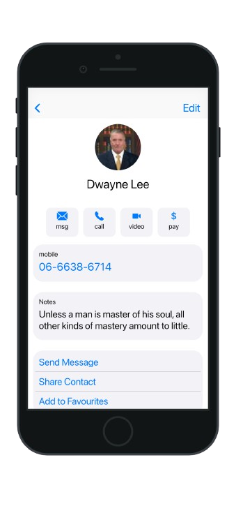

# iPhone Contacts App Clone

This project is a UI clone of the iPhone Contacts app, with responsive design to ensure compatibility across different screen sizes. It has been tested on multiple iPhone models including iPhone 13 and iPhone SE, and works seamlessly on both.

## Features

- **Home Screen:** Displays the list of contacts similar to the iPhone Contacts app.
- **Contact Details:** Displays detailed information of each contact when selected from the home screen.
- **Responsive Design:** The UI adapts to different screen sizes, making the app compatible across all iPhone models.

## Screenshots

### iPhone 13 Screenshots

*Home Screen - iPhone 13*

*Contact Details - iPhone 13*

### iPhone SE Screenshots

*Home Screen - iPhone SE*

*Contact Details - iPhone SE*

## Responsive UI

The UI is designed to be responsive, tested on multiple screen sizes including iPhone 13 and iPhone SE. The app dynamically adjusts its layout to ensure optimal viewing and interaction on all devices.

## How to Run

1. Clone the repository.
2. Run the app on a simulator or physical device using Xcode or a similar IDE.

## Download Link

[Download the project](#)

